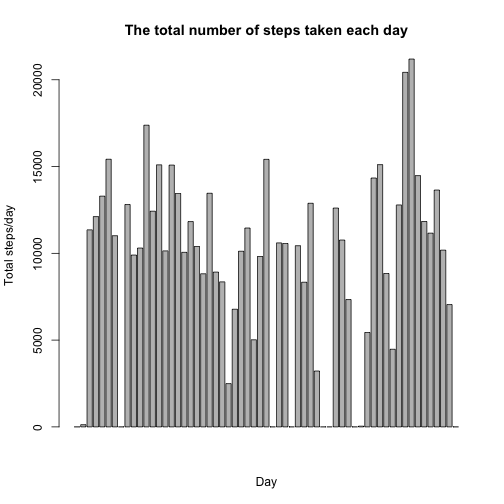
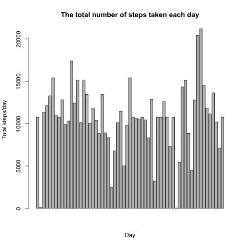

# Reproducible Research: Peer Assessment 1

This report analyzes and summarizes the activity monitoring data collected by one of the activity monitoring devices over the period of 2 months presented in `avtivity.csv` dataset.  
  
This report presents both code and results. This report has 2 major parts; **Loading and processing data** and **Results**. 

## Loading and preprocessing the data:

### 1. load the dataset


```r
dataset <- read.csv("activity.csv", header=T)
```


### 2. Preprocessing the data  
          
#### Splitting over the days and calculate the total steps per day, mean steps and median steps
        

```r
dayslist <- split(dataset, dataset$date)
dailysteps <- data.frame()
for (day in 1:length(dayslist)) {
        dailysteps[day,1] <- names(dayslist)[day]
        dailysteps[day,2] <- sum(dayslist[[day]]$steps, na.rm=T)
        dailysteps[day,3] <- mean(dayslist[[day]]$steps, na.rm=T)
        dailysteps[day,4] <- median(dayslist[[day]]$steps, na.rm=T)
}

colnames(dailysteps) <- c("date", "total.steps", "mean", "median")
```

#### Splitting over 5-minute time intervals over all days and calculating the average steps per time interval


```r
intervals <- split(dataset, dataset$interval)
intervalsDF <- data.frame()
for (interval in 1:length(intervals)) {
        intervalsDF[interval,1] <- names(intervals)[interval]
        intervalsDF[interval,2] <- mean(intervals[[interval]]$steps, na.rm=T)
}

colnames(intervalsDF) <- c("interval", "average.across.days")
```

#### Imputing missing values


```r
# Imputation of missing values
ImputedSteps <- data.frame()

for (row in 1:nrow(dataset)) {
        if (is.na(dataset[row,1])) {
                time.interval <- dataset$interval[row]
                grepterm <- paste0("^",time.interval,"$")
                intervalindex <- grep(grepterm, intervalsDF[,1])
                avg.interval <- intervalsDF[intervalindex, 2]
                ImputedSteps[row,1] <- avg.interval
        } else {
                ImputedSteps[row, 1] <- dataset[row,1]
        }
}

ImputedDF <- cbind(ImputedSteps, dataset[,2:3])
colnames(ImputedDF) <- colnames(dataset)
```


```r
# Splitting over days

imputedlist <- split(ImputedDF, ImputedDF$date)
imputeddaily <- data.frame()
for (day in 1:length(imputedlist)) {
        imputeddaily[day,1] <- names(imputedlist)[day]
        imputeddaily[day,2] <- sum(imputedlist[[day]][,1])
        imputeddaily[day,3] <- mean(imputedlist[[day]][,1])
        imputeddaily[day,4] <- median(imputedlist[[day]][,1])
}

colnames(imputeddaily) <- c("date", "total.steps", "mean", "median")
```

#### Adding weekdays and splitting over 5-minute time intervals over all days and calculating the average steps per time interval for weekdays versus weekends


```r
# Convert date column into Date/Time class
ImputedDF$date <- strptime(ImputedDF$date, format="%Y-%m-%d")
weekday <- weekdays(ImputedDF$date)
imputeddaily2 <- cbind(ImputedDF, weekday)

# Split dataset into 2 data frames; weekdays and weekends
weekends <- grep('Saturday|Sunday', imputeddaily2$weekday)
weekdays <- grep('[^Saturday|Sunday]', imputeddaily2$weekday)
weekend.set <- imputeddaily2[weekends,]
weekday.set <- imputeddaily2[weekdays,]

# Split over time interval
# Weekend data frame
WEintervals <- split(weekend.set, weekend.set$interval)
WEintervalsDF <- data.frame()
for (interval in 1:length(WEintervals)) {
        WEintervalsDF[interval,1] <- names(WEintervals)[interval]
        WEintervalsDF[interval,2] <- mean(WEintervals[[interval]]$steps)
}
colnames(WEintervalsDF) <- c("interval", "average.across.days")

# Weekday data frame
WDintervals <- split(weekday.set, weekday.set$interval)
WDintervalsDF <- data.frame()
for (interval in 1:length(WDintervals)) {
        WDintervalsDF[interval,1] <- names(WDintervals)[interval]
        WDintervalsDF[interval,2] <- mean(WDintervals[[interval]]$steps)
}
colnames(WDintervalsDF) <- c("interval", "average.across.days")
```

## What is mean total number of steps taken per day?

**1. A histogram of the total number of steps taken each day**


```r
barplot(dailysteps$total.steps, main="The total number of steps taken each day", xlab="Day", ylab="Total steps/day")
```

 

**2. The mean and median total number of steps taken per day**

* The mean total number of steps taken per day  
        

```r
meansteps <- mean(dailysteps$total.steps, na.rm=T)
```

The mean total number of steps taken per day is **9354.2295** steps/day.
  
* The median total number of steps taken per day
        

```r
mediansteps <- median(dailysteps$total.steps, na.rm=T)
```

The median total number of steps taken per day is **10395** steps/day.  

## What is the average daily activity pattern?

**1. A time series plot of the 5-minute interval (x-axis) and the average number of steps taken, averaged across all days (y-axis)**  


```r
plot(intervalsDF$interval, intervalsDF$average.across.days, type = "l", 
     main = "The average daily activity pattern", xlab="5-minute time interval",
     ylab= "Average steps across all days")
```

 

**2.The 5-minute interval that have the maximum average steps across all days**


```r
MaxSteps <- max(intervalsDF$average.across.days)
MaxInterval <- intervalsDF$interval[grep(MaxSteps, intervalsDF$average.across.days)]
```

The 5-minute interval, on average across all the days in the dataset, which contains the maximum number of steps is the **835** interval.

## Imputing missing values

**1. The total number of missing values in the dataset**


```r
missingvector <- is.na(dataset$steps)
missing <- sum(missingvector)
total <- length(missingvector)
```

The total number of missing values is **2304** out of total **17568** observations.

**2&3. A strategy for filling in all of the missing values in the dataset.**

The strategy is replacing all NA values with thw average of the 5-minute time interval across all days. A new dataset created **`ImputedDF`** with the missing values filled in. See **'Loading and processing data > Imputing missiing values'**.

**4. A histogram of the total number of steps taken each day for the imputed dataset**


```r
barplot(imputeddaily$total.steps, main="The total number of steps taken each day", xlab="Day", ylab="Total steps/day")
```

 

**5. The mean and median total number of steps taken per day for the imputed dataset**

* The mean total number of steps taken per day  
        

```r
meansteps.imp <- mean(imputeddaily$total.steps)
```

The mean total number of steps taken per day is **1.0766 &times; 10<sup>4</sup>** steps/day.
  
* The median total number of steps taken per day
        

```r
mediansteps.imp <- median(imputeddaily$total.steps)
```

The median total number of steps taken per day is **1.0766 &times; 10<sup>4</sup>** steps/day.

**6. How values differ from the estimates from the non-imputed dataset What is the impact of imputing missing data on the estimates of the total daily number of steps?**


```r
diffmean <- meansteps.imp-meansteps
diffmedian <- mediansteps.imp-mediansteps
```

As the NA values was ignored in calculating the summation of daiy steps in the non-imputed dataset, its mean is lower by **1411.9592** and its median is lower by **371.1887** than the imputed dataset whose fields were filled with positive values. 

## Differences in activity patterns between weekdays and weekends

**A panel plot containing a time series plot of the 5-minute interval (x-axis) and the average number of steps taken, averaged across all weekday days or weekend days (y-axis).**


```r
par(mfrow=c(2,1))
plot(WEintervalsDF$interval, WEintervalsDF$average.across.days, type = "l", 
     main = "Weekend", xlab="Interval",
     ylab= "Average steps")
plot(WDintervalsDF$interval, WDintervalsDF$average.across.days, type = "l", 
     main = "Weekday", xlab="Interval",
     ylab= "Average steps")
```

 


